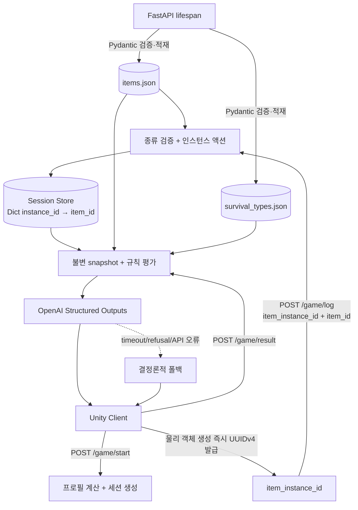

# BAGSCAPE Backend Plan

> 문서 버전: 3.0.0  
> 기준일: 2026-07-19  
> 목적: MR 기반 72시간 생존 탈출 게임 BAGSCAPE의 동적 객체·정적 DB·API 구현 기준 정의

## 1. 시스템 개요

BAGSCAPE 백엔드는 Unity Client와 세션 기반 게임 루프를 구성한다.

1. `/game/start`에서 플레이어 프로필과 재난을 받아 세션, BMR, 72시간 수분 요구량, 가방 중량 상한을 반환한다.
2. Unity가 생성한 각 물리 객체의 `item_instance_id`를 `/game/log`로 받아 INSERT/REMOVE를 추적한다.
3. `/game/result`에서 인벤토리와 행동 로그를 확정하고 정적 규칙과 OpenAI Structured Outputs로 최종 결과를 만든다.

MR 환경에서는 같은 종류의 아이템이 런타임에 여러 번 생성될 수 있다. 따라서 정적 종류 ID `item_id`와 동적 물리 객체 ID `item_instance_id`를 반드시 분리한다. 수치 계산과 catalog 검증의 단일 진실 공급원은 FastAPI이며 LLM은 서버가 확정한 사실을 변경하거나 재계산하지 않는다.

본 문서의 BMR·수분·중량 값은 게임 밸런스용 기준값이며 의료·재난 안전 지침이 아니다.

### 1.1 기술 스택

| 영역 | 기술 | 역할 |
|---|---|---|
| API | FastAPI (Python) | 요청 검증, 세션 처리, 결과 직렬화 |
| 데이터 계약 | Pydantic v2 | API 및 정적 JSON schema 강제 |
| AI | OpenAI Python SDK + Structured Outputs | 구조화 결과 생성, 장애 시 규칙 폴백 |
| Static DB | `items.json`, `survival_types.json` | 기동 시 검증하는 읽기 전용 catalog |
| Session Store | `dict[UUID, GameSession]` | TTL 인메모리 세션과 동적 인벤토리 |
| 동시성 | `asyncio.Lock` | log/result 원자성 및 결과 단일 생성 |
| 테스트 | pytest, httpx/TestClient | schema, catalog, API, 규칙, 경합 검증 |

인메모리 저장소를 사용하는 동안에는 `uvicorn --workers 1`로 실행한다. 수평 확장 시 Session Repository 계약을 유지한 채 Redis 등 외부 원자 저장소로 교체한다.

### 1.2 모듈 경계

```text
app/
  main.py
  api/game.py
  schemas/game.py          # 공개 API schema
  schemas/item.py          # items.json schema
  schemas/survival.py      # survival_types.json 및 AI Context schema
  repositories/catalogs.py
  repositories/sessions.py
  domain/preprocessor.py
  domain/rules.py
  ai/prompts.py
  ai/evaluator.py
  services/survival.py
  core/config.py
  core/errors.py
items.json
survival_types.json
tests/
```

## 2. 아키텍처와 데이터 흐름



### 2.1 처리 순서

1. lifespan에서 두 JSON 배열을 Pydantic으로 검증한다. 누락·잘못된 JSON·extra field·중복 키가 있으면 기동을 실패시킨다.
2. `/game/start`가 UUID `session_id`와 빈 `dict` inventory를 갖는 세션을 만든다.
3. Unity는 물리 아이템 생성 직후 `System.Guid.NewGuid()`로 UUIDv4 `item_instance_id`를 만들고 객체가 존재하는 동안 보존한다.
4. `/game/log`는 `item_id`가 `items.json`에 있는지만 정적으로 검증한다. `item_instance_id`는 catalog나 서버에 사전 등록하지 않으며 유효한 UUIDv4이면 동적으로 수용한다.
5. 세션 lock 안에서 `inventory[item_instance_id] = item_id` 형태로 액션을 반영하고 append-only 로그와 응답을 함께 저장한다.
6. `/game/result`는 lock 안에서 인스턴스-종류 쌍과 로그의 불변 snapshot을 만들고 세션을 `RESULT_PENDING`으로 바꾼다.
7. 전처리기는 모든 인스턴스를 개별 항목으로 합산한다. 동일 `item_id`가 여러 번 있어도 중복 제거하지 않는다.
8. 정상 또는 폴백 결과를 캐시하고 세션을 `COMPLETED`로 전환한다. 같은 결과 요청은 같은 응답을 반환한다.

### 2.2 안정성 원칙

- 세션별 lock으로 `/game/log`와 `/game/result`를 직렬화한다.
- 마지막 활동 기준 TTL 기본값은 2시간이며 만료 시 `410 SESSION_EXPIRED`를 반환한다.
- inventory 최대 크기는 서로 다른 인스턴스 50개, action log 최대 크기는 500개다.
- `RESULT_PENDING` 이후 로그는 `409 SESSION_COMPLETED`로 거부한다.
- LLM timeout은 8초, 전체 결과 요청 timeout은 10초를 권장한다.
- timeout/rate limit/서버 오류만 최대 1회 재시도하고 refusal은 즉시 폴백한다.
- 로그에는 전체 prompt나 원본 세션 ID 대신 request ID, 해시 식별자, 지연, 오류·폴백 여부를 기록한다.

## 3. Pydantic 모델 및 스키마 정의

이 장의 필드명이 구현과 JSON 원본의 기준이다. 이전 `weight_grams`, `water_ml`, `tags`, `type_id`, `title`, 점수·flag 필드는 새 정적 DB schema에 포함하지 않는다.

### 3.1 공개 API 모델

```python
from datetime import datetime
from enum import StrEnum
from typing import Annotated
from uuid import UUID

from pydantic import (
    BaseModel,
    ConfigDict,
    Field,
    StringConstraints,
    field_validator,
)

NonBlankText = Annotated[str, StringConstraints(strip_whitespace=True, min_length=1)]
ItemId = Annotated[str, StringConstraints(pattern=r"^[A-Za-z0-9_-]{1,64}$")]


class Gender(StrEnum):
    MALE = "male"
    FEMALE = "female"
    OTHER = "other"


class AgeGroup(StrEnum):
    CHILD = "child"
    TEEN = "teen"
    AGE_20_30 = "age_20_30"
    AGE_40_50 = "age_40_50"
    AGE_60_PLUS = "age_60_plus"


class DisasterType(StrEnum):
    FIRE = "fire"
    FLOOD = "flood"
    TYPHOON = "typhoon"
    WILDFIRE = "wildfire"
    EARTHQUAKE = "earthquake"
    HEATWAVE = "heatwave"
    COLDWAVE = "coldwave"


class InventoryAction(StrEnum):
    INSERT = "INSERT"
    REMOVE = "REMOVE"


class GameStartRequest(BaseModel):
    model_config = ConfigDict(extra="forbid")
    gender: Gender
    age_group: AgeGroup
    disaster: DisasterType


class GameStartResponse(BaseModel):
    model_config = ConfigDict(extra="forbid")
    session_id: UUID
    reference_bmr_kcal_day: int = Field(gt=0)
    required_water_72h_ml: int = Field(gt=0)
    max_carry_weight_kg: float = Field(gt=0)
    expires_at: datetime


class GameLogRequest(BaseModel):
    model_config = ConfigDict(extra="forbid")
    session_id: UUID
    action_id: UUID = Field(description="HTTP 액션 멱등 키")
    action: InventoryAction
    item_instance_id: UUID = Field(
        description="Unity가 물리 객체 생성 시 발급한 UUIDv4"
    )
    item_id: ItemId
    occurred_at: datetime

    @field_validator("item_instance_id")
    @classmethod
    def require_uuid_v4(cls, value: UUID) -> UUID:
        if value.version != 4:
            raise ValueError("item_instance_id must be UUIDv4")
        return value

    @field_validator("occurred_at")
    @classmethod
    def require_timezone(cls, value: datetime) -> datetime:
        if value.tzinfo is None or value.utcoffset() is None:
            raise ValueError("occurred_at must include timezone")
        return value


class GameLogResponse(BaseModel):
    model_config = ConfigDict(extra="forbid")
    session_id: UUID
    action_id: UUID
    item_instance_id: UUID
    applied: bool
    item_count: int = Field(ge=0, le=50)
    current_weight_grams: int = Field(ge=0)


class GameResultRequest(BaseModel):
    model_config = ConfigDict(extra="forbid")
    session_id: UUID


class SurvivalResponse(BaseModel):
    model_config = ConfigDict(extra="forbid", str_strip_whitespace=True)
    survival_type: NonBlankText = Field(max_length=80)
    evaluation_narrative: NonBlankText = Field(max_length=2_000)
    survival_time_hours: int = Field(ge=0, le=72)
```

`item_instance_id`는 요청에 반드시 존재해야 하며 표준 하이픈 UUIDv4 문자열로 직렬화한다. 서버는 UUID 형식·버전만 검증하고 사전 등록 여부나 `items.json` 존재 여부를 확인하지 않는다. 정적 catalog 조회 대상은 오직 `item_id`다.

### 3.2 `items.json` 확정 스키마

```python
from typing import Annotated

from pydantic import BaseModel, ConfigDict, Field, StringConstraints, field_validator

NonBlankText = Annotated[str, StringConstraints(strip_whitespace=True, min_length=1)]
TargetDisaster = str | list[str]


class ItemDefinition(BaseModel):
    model_config = ConfigDict(
        extra="forbid",
        frozen=True,
        str_strip_whitespace=True,
    )

    item_id: ItemId
    category: NonBlankText = Field(max_length=80)
    name: NonBlankText = Field(max_length=80)
    weight_kg: float = Field(ge=0, le=50)
    importance_score: int = Field(ge=0, le=5)
    target_disaster: TargetDisaster

    @field_validator("target_disaster")
    @classmethod
    def validate_target_disaster(cls, value: TargetDisaster) -> TargetDisaster:
        values = [value] if isinstance(value, str) else value
        normalized = [entry.strip() for entry in values]
        if not normalized or any(not entry for entry in normalized):
            raise ValueError("target_disaster must contain non-blank text")
        if len(normalized) != len(set(normalized)):
            raise ValueError("target_disaster must not contain duplicates")
        return normalized[0] if isinstance(value, str) else normalized
```

필드 의미는 다음과 같다.

| 필드 | 타입 | 의미 |
|---|---|---|
| `item_id` | string | 정적 아이템 종류의 고유 ID |
| `category` | string | 표시·평가 카테고리. 이모지와 한글 허용 |
| `name` | string | 아이템 표시 이름 |
| `weight_kg` | float | 한 인스턴스의 kg 단위 중량 |
| `importance_score` | integer | 0~5 중요도 |
| `target_disaster` | string 또는 string[] | 활용 재난. 예: `전체`, `장기 대피`, `없음` |

```json
[
  {
    "item_id": "item_water",
    "category": "💧 식수",
    "name": "생수",
    "weight_kg": 2.0,
    "importance_score": 5,
    "target_disaster": ["전체", "장기 대피"]
  },
  {
    "item_id": "item_game_console",
    "category": "🎮 오락",
    "name": "게임기",
    "weight_kg": 0.4,
    "importance_score": 1,
    "target_disaster": "없음"
  }
]
```

### 3.3 `survival_types.json` 확정 스키마

```python
TypeCode = Annotated[str, StringConstraints(pattern=r"^[A-Za-z0-9_-]{1,32}$")]


class SurvivalTypeDefinition(BaseModel):
    model_config = ConfigDict(
        extra="forbid",
        frozen=True,
        str_strip_whitespace=True,
    )

    type_code: TypeCode
    name: NonBlankText = Field(max_length=80)
    description: NonBlankText = Field(max_length=500)
```

```json
[
  {
    "type_code": "SPSP",
    "name": "Smart Planner Survivor",
    "description": "균형 잡힌 준비형"
  },
  {
    "type_code": "OWLP",
    "name": "Overloaded Warrior",
    "description": "너무 많은 물건을 챙김"
  }
]
```

`survival_types.json`은 칭호 catalog다. 점수 범위나 우선순위처럼 확정 schema에 없는 값을 파일에 암묵적으로 요구하지 않는다. 결정론적 매핑 조건은 `domain/rules.py`의 버전 관리된 `type_code` 규칙으로 두고, 서버 기동 시 규칙에서 참조하는 모든 코드가 catalog에 있는지 검증한다.

### 3.4 정적 DB 로더

```python
import json
from pathlib import Path
from types import MappingProxyType
from typing import Mapping

from pydantic import TypeAdapter

item_list_adapter = TypeAdapter(list[ItemDefinition])
type_list_adapter = TypeAdapter(list[SurvivalTypeDefinition])


def load_item_catalog(path: Path) -> Mapping[str, ItemDefinition]:
    records = item_list_adapter.validate_python(
        json.loads(path.read_text(encoding="utf-8"))
    )
    catalog = {record.item_id: record for record in records}
    if len(catalog) != len(records):
        raise ValueError("items.json contains duplicate item_id")
    return MappingProxyType(catalog)


def load_survival_type_catalog(
    path: Path,
) -> Mapping[str, SurvivalTypeDefinition]:
    records = type_list_adapter.validate_python(
        json.loads(path.read_text(encoding="utf-8"))
    )
    catalog = {record.type_code: record for record in records}
    if len(catalog) != len(records):
        raise ValueError("survival_types.json contains duplicate type_code")
    return MappingProxyType(catalog)
```

두 파일은 요청마다 읽지 않고 lifespan에서 한 번만 적재한다. hot reload는 지원하지 않으며 파일 변경은 새 프로세스의 readiness 통과 후 반영한다.

## 4. Session Store 구조와 동적 인벤토리 규칙

### 4.1 목표 구조

```python
import asyncio
from dataclasses import dataclass, field
from datetime import datetime
from typing import Any
from uuid import UUID


@dataclass(frozen=True)
class ActionLogEntry:
    request: GameLogRequest
    received_at: datetime
    applied: bool


@dataclass
class GameSession:
    session_id: UUID
    start_request: GameStartRequest
    created_at: datetime
    last_activity_at: datetime
    expires_at: datetime

    # 핵심: 물리 객체 인스턴스 → 정적 아이템 종류
    inventory: dict[UUID, str] = field(default_factory=dict)

    action_logs: list[ActionLogEntry] = field(default_factory=list)
    action_requests: dict[UUID, GameLogRequest] = field(default_factory=dict)
    action_responses: dict[UUID, GameLogResponse] = field(default_factory=dict)
    status: SessionStatus = SessionStatus.ACTIVE
    cached_result: SurvivalResponse | None = None
    result_task: asyncio.Task[SurvivalResponse] | None = None
    result_snapshot: Any | None = None
    lock: asyncio.Lock = field(default_factory=asyncio.Lock)
```

`dict`의 key가 물리 객체의 정체성이고 value가 정적 속성 조회용 종류 ID다. 동일한 `item_id`의 서로 다른 key는 모두 독립된 가방 항목이다.

### 4.2 INSERT/REMOVE 알고리즘

```python
async def apply_log(request: GameLogRequest, session: GameSession) -> GameLogResponse:
    item = item_catalog.get(request.item_id)
    if item is None:
        raise unknown_item()

    async with session.lock:
        existing_item_id = session.inventory.get(request.item_instance_id)

        if existing_item_id is not None and existing_item_id != request.item_id:
            raise item_instance_conflict()

        if request.action is InventoryAction.INSERT:
            applied = existing_item_id is None
            if applied and len(session.inventory) >= 50:
                raise inventory_limit()
            if applied:
                session.inventory[request.item_instance_id] = request.item_id
        else:
            applied = existing_item_id == request.item_id
            if applied:
                del session.inventory[request.item_instance_id]

        current_weight_grams = sum(
            round(item_catalog[item_id].weight_kg * 1000)
            for item_id in session.inventory.values()
        )
```

운영 구현에서는 부동소수점 누적 오차를 피하기 위해 catalog 로딩 시 `Decimal(str(weight_kg)) * 1000`으로 정수 g 파생값을 만들고 합산한다. 정확히 중량 상한과 같으면 초과가 아니다.

### 4.3 멱등성·충돌 의미

- 같은 `action_id`와 완전히 같은 payload 재전송: 최초 응답 반환, 상태·로그 중복 변경 없음.
- 같은 `action_id`에 `item_instance_id`를 포함한 어느 필드라도 다름: `409 ACTION_ID_CONFLICT`.
- 같은 `item_instance_id`와 같은 `item_id` INSERT: 정상 no-op, `applied=false`.
- 존재하지 않는 instance REMOVE: 정상 no-op, `applied=false`.
- 같은 `item_instance_id`가 다른 `item_id`와 연결됨: `409 ITEM_INSTANCE_CONFLICT`.
- instance ID의 유일성 범위는 세션 내부다. 서로 다른 세션에서 우연히 같은 UUID가 전달되어도 상태는 섞이지 않는다.

### 4.4 Snapshot과 행동 분석

snapshot은 종류 목록만 보존하지 않고 정렬된 `(item_instance_id, item_id)` 쌍을 보존한다. 넣었다 뺀 행동, 반복 선택, 핵심 물품 제거는 인스턴스 ID 기준으로 판정하고 사용자 서사에서는 catalog의 이름과 종류별 개수로 요약한다. 예를 들어 같은 생수 두 개 중 하나만 제거하면 제거된 인스턴스만 행동 이력에 남고 최종 inventory에는 생수 한 개가 유지된다.

## 5. 전처리 및 결과 평가

### 5.1 프로필과 수분 요구량

기존 15개 프로필과 7개 재난 배수는 유지한다.

| 나이대 | male BMR/중량 | female BMR/중량 | other BMR/중량 | 수분 계수 ml/kg/day |
|---|---|---|---|---:|
| child | 1400 / 4.50kg | 1300 / 4.20kg | 1350 / 4.20kg | 55 |
| teen | 1900 / 9.90kg | 1650 / 9.00kg | 1775 / 9.00kg | 40 |
| age_20_30 | 1650 / 14.00kg | 1350 / 11.00kg | 1500 / 11.00kg | 35 |
| age_40_50 | 1550 / 12.96kg | 1300 / 10.44kg | 1425 / 10.44kg | 30 |
| age_60_plus | 1400 / 10.20kg | 1200 / 8.25kg | 1300 / 8.25kg | 30 |

재난 수분 배수는 폭염 1.30, 산불 1.20, 화재 1.15, 홍수·태풍·한파 1.05, 지진 1.00이다.

```text
required_water_72h_ml = ceil_to_10ml(
  reference_weight_kg × water_coefficient × 3 × disaster_multiplier
)
```

### 5.2 확정 아이템 schema 기반 평가

확정 `items.json`에는 `water_ml`과 세부 기능 `tags`가 없다. 서버는 아이템 이름이나 이모지에서 숨은 수치를 추정하지 않는다.

- `total_weight_grams`: 모든 inventory instance의 `weight_kg` 합계.
- `importance_total`: 모든 instance의 `importance_score` 합계.
- `important_item_count`: 중요도 4~5인 instance 수.
- `category_counts`: category별 instance 수.
- `category_weight_ratio`: category별 중량 비율.
- `disaster_relevant_count`: `target_disaster`가 `전체` 또는 현재 재난 표시명과 일치하는 instance 수.
- `irrelevant_count`: `target_disaster`가 `없음`이거나 현재 재난과 불일치하는 instance 수.
- `is_overweight`: 총중량이 프로필 상한을 초과하는지 여부.

`required_water_72h_ml`은 시작 UI와 평가 기준으로 유지하지만 확보 식수 ml는 계산하지 않는다. 식수 카테고리의 보유 개수·중량·중요도로 정성 평가한다. 정확한 수분 충족률이 다시 필요하면 `items.json` 계약에 용량 필드를 기획 승인 후 추가해야 한다.

### 5.3 생존 유형 매핑

`survival_types.json`은 `type_code`, `name`, `description`만 가진 표시 catalog다. 규칙 엔진은 버전 관리된 조건에서 `type_code`를 선택하고 catalog에서 `name`과 `description`을 조회한다. 예를 들어 과적 조건은 `OWLP`로 매핑할 수 있다. 규칙이 참조하는 type code가 catalog에 없으면 readiness를 실패시킨다.

AI Context에는 선택된 code/name/description, 허용 후보 code/name, 중량·중요도·카테고리·재난 적합도와 인스턴스 기반 행동 요약을 넣는다. AI가 허용 후보 밖의 값을 반환하면 최상위 규칙 결과의 `name`으로 교정한다.

## 6. API 엔드포인트 명세

### 6.1 `POST /game/start`

Request:

```json
{
  "gender": "female",
  "age_group": "age_20_30",
  "disaster": "wildfire"
}
```

Success `201 Created`:

```json
{
  "session_id": "ed503034-9522-41f9-961c-a429796fcf51",
  "reference_bmr_kcal_day": 1350,
  "required_water_72h_ml": 6930,
  "max_carry_weight_kg": 11.0,
  "expires_at": "2026-07-19T14:00:00Z"
}
```

### 6.2 `POST /game/log` — 동적 UUID 수용

| 항목 | 명세 |
|---|---|
| Request / Response | `GameLogRequest` / `GameLogResponse` |
| Success | `200 OK` |
| 정적 검증 | `item_id`가 `items.json`에 존재하는지 확인 |
| 동적 검증 | `item_instance_id`가 UUIDv4인지 확인; 사전 등록은 요구하지 않음 |
| 원자성 | 세션 lock에서 inventory, action log, 멱등 응답을 함께 반영 |

Request:

```json
{
  "session_id": "ed503034-9522-41f9-961c-a429796fcf51",
  "action_id": "01e55799-7922-489d-b709-3ca91d1974e2",
  "action": "INSERT",
  "item_instance_id": "d8e2fd73-a12c-4e07-a282-3bc72f473b6d",
  "item_id": "item_water",
  "occurred_at": "2026-07-19T12:08:21+09:00"
}
```

Response:

```json
{
  "session_id": "ed503034-9522-41f9-961c-a429796fcf51",
  "action_id": "01e55799-7922-489d-b709-3ca91d1974e2",
  "item_instance_id": "d8e2fd73-a12c-4e07-a282-3bc72f473b6d",
  "applied": true,
  "item_count": 1,
  "current_weight_grams": 2000
}
```

두 번째 생수를 새 UUID로 INSERT하면 같은 `item_id`여도 `item_count=2`, `current_weight_grams=4000`이 된다. 첫 UUID를 REMOVE하면 해당 인스턴스만 사라지고 두 번째 생수는 유지된다.

### 6.3 `POST /game/result`

Request:

```json
{"session_id": "ed503034-9522-41f9-961c-a429796fcf51"}
```

Success `200 OK`:

```json
{
  "survival_type": "Smart Planner Survivor",
  "evaluation_narrative": "중요도가 높은 재난 대응 물품을 여러 카테고리에 고르게 배치했고 가방 중량도 허용 범위에 유지했다. 같은 종류의 물품도 실제 인스턴스 수만큼 반영되어 준비 수준과 선택 행동이 일관되게 평가됐다.",
  "survival_time_hours": 61
}
```

공개 결과에는 위 세 필드만 존재한다. 동일 세션의 재요청은 캐시된 동일 결과를 반환한다.

### 6.4 오류 계약

| HTTP | 코드 | 조건 |
|---:|---|---|
| 404 | `SESSION_NOT_FOUND` | 존재하지 않는 세션 |
| 410 | `SESSION_EXPIRED` | TTL 만료 |
| 409 | `SESSION_COMPLETED` | 결과 snapshot 뒤 로그 |
| 409 | `ACTION_ID_CONFLICT` | 같은 action ID의 payload 변경 |
| 409 | `ITEM_INSTANCE_CONFLICT` | 같은 instance ID를 다른 item ID로 사용 |
| 409 | `INVENTORY_LIMIT` | 50번째를 넘는 instance INSERT |
| 422 | `UNKNOWN_ITEM` | `items.json`에 없는 `item_id` |
| 422 | `VALIDATION_ERROR` | 누락, 잘못된 UUIDv4, enum, timezone 등 |
| 429 | `LOG_LIMIT_REACHED` | 세션 로그 500개 초과 |
| 504 | `RESULT_TIMEOUT` | 결과 요청 시간 예산 초과 |

오류 envelope는 `{"error":{"code":"...","message":"..."}}` 형식이다.

## 7. Unity 계약

```csharp
public sealed class SpawnedItem : MonoBehaviour
{
    [SerializeField] private string itemId;
    public string ItemInstanceId { get; private set; }

    private void Awake()
    {
        ItemInstanceId = System.Guid.NewGuid().ToString("D");
    }
}
```

- clone을 포함한 새 물리 객체마다 새 UUIDv4를 한 번만 생성한다.
- 같은 객체를 가방에서 꺼냈다가 다시 넣을 때는 같은 `item_instance_id`를 유지한다.
- 네트워크 재시도는 `action_id`, `item_instance_id`, payload 전체를 그대로 유지한다.
- 새 조작에는 새 `action_id`를 사용하되 물리 객체의 `item_instance_id`는 바꾸지 않는다.
- 클라이언트는 순차 action queue를 사용하고 모든 로그 ACK 후 결과를 요청한다.

## 8. OpenAI Structured Outputs

Prompt에는 서버가 계산한 중량, 중요도, 카테고리 균형, 재난 적합도, 인스턴스 기반 행동 요약과 허용 survival type 후보만 전달한다. 아이템 name/category/description은 데이터로 취급하고 명령으로 해석하지 않는다.

`SurvivalResponse`의 세 필드는 모두 required이며 `extra="forbid"`다. timeout, rate limit, API 서버 오류, refusal, parsed 결과 부재는 결정론적 폴백으로 동일 schema의 `200 OK`를 반환한다. 모델이 허용 후보 밖 칭호를 반환하면 규칙 엔진이 선택한 catalog name으로 교정한다.

## 9. 필수 테스트 및 배포 기준

### 9.1 테스트

- Schema: `item_instance_id` 누락, UUIDv1, 잘못된 UUID, timezone 누락, extra field 거부.
- Dynamic inventory: 같은 종류의 서로 다른 UUID 다중 INSERT, 한 인스턴스만 REMOVE, instance/item 충돌.
- Capacity: 50번째 성공, 51번째 원자적 실패, 같은 종류 N개 중량 N배 합산.
- Idempotency: 동일 action 재시도, payload 변경 충돌, 응답의 instance ID echo.
- Catalog: 새 확정 필드, `target_disaster` union, 범위, duplicate key, extra field, 읽기 전용성.
- Snapshot: `(instance_id, item_id)` 보존, log/result 경합, 결과 중 inventory 불변.
- Rules/AI: 새 필드 기반 점수, type code 참조 무결성, 후보 교정, timeout/refusal 폴백.
- API: start → 동일 종류 다중 log → 일부 remove → result 전체 루프.

### 9.2 배포

이 변경은 `/game/log` 필수 필드와 두 JSON schema를 바꾸므로 하위 호환되지 않는 major 변경이다. 실제 코드, `items.json`, `survival_types.json`, Unity를 같은 릴리스로 배포한다. 구 클라이언트는 `item_instance_id` 누락으로 422가 되므로 동시 지원이 필요하면 `/v2/game/*` 같은 별도 API 버전을 먼저 도입한다.

## 10. 구현 현황과 후속 작업

이 문서는 목표 설계다. 현재 애플리케이션 코드는 아직 `set[item_id]`와 이전 JSON 필드를 사용하므로 구현 완료로 간주하지 않는다. 구체적인 파일별 작업·검토 게이트는 `dynamic_spawn_migration_plan.md`를 따른다.

## 11. 수정 이력 (Changelog)

| 날짜 | 버전 | 변경된 로직 |
|---|---|---|
| 2026-07-18 | 0.1.0 | 최초 공개 스키마와 프로필·재난 규칙 정의 |
| 2026-07-18 | 1.0.0 | OpenAI Structured Outputs와 정적 items catalog 도입 |
| 2026-07-18 | 2.0.0 | 세션 기반 `/game/start`, `/game/log`, `/game/result` 및 행동 로그 도입 |
| 2026-07-19 | 2.1.0 | timeout·재시도·동시성·오류 envelope·CI 기준 강화 |
| 2026-07-19 | 2.1.1 | 최종 inventory 기반 행동 요약과 회귀 테스트 기준 보강 |
| 2026-07-19 | 3.0.0 | **MR 환경 실시간 동적 객체 스폰 지원을 위한 `item_instance_id` 도입 및 정적 DB 스키마 확정**. 인벤토리를 `Dict[item_instance_id, item_id]`로 변경하고 동일 종류 다중 적재, UUIDv4 동적 수용, 인스턴스 충돌 규칙, 확정 `items.json`·`survival_types.json` Pydantic 모델과 마이그레이션 기준을 정의함. |
